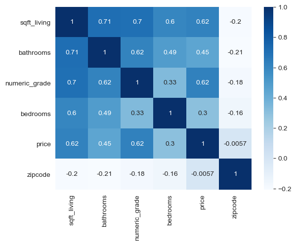

# King County House Analysis

### Authors: [Amos Kipkirui, Brian Muli, Emilly Njue, Swaleh Athuman, Samwel Kagwi, Heddy Berit](https://github.com/swalehmwadime/dsc-phase-2-project-v2-3.git)

## Overview

This project uses linear regression analysis to understand how certain variables impact housing prices in King County. We will be building different models in order to create the most accurate coefficients and the highest R-squared value.

## Data
This project used the King County House Sales dataset, which can be found in  `kc_house_data.csv` in the data folder in the project`s GitHub repository. The description of the column names can be found in `student.ipynb` in the same folder. This data is originally from the King County [website](https://gis-kingcounty.opendata.arcgis.com/).

### Features used in final model:
- price
- bedrooms
- bathrooms
- sqft_living
- numeric_grade 
- zipcode

## Data Cleaning

We needed to clean this data before we could use it in our linear regression model.  The cleaning steps that we followed were:

#### Finding and Dropping Missing Data
There was missing data in waterfront and year renovated columns that were then dropped.

#### Changing Categorical to Numeric Variables
We had two variables that needed to be changed from categorical values to numeric before we could perform any functions on them.  The variables were grade and zipcode.

#### Dropping Outliers
We removed outliers from our variables.

## Methodology
We used pandas and numpy explore the data. Sklearn and statsmodel.api to determine R scores and the root mean squared error. Matplotlib, seaborn, and folium  were used for visualizations. We droped duplicates and filled nulls with the most common value in the column. Then we one hot encoded categorical variables. Next we ran a train-test split on the data and removed outliers to avoid data leakage. Additionally, we standard scaled our train and test, ran numerous models comparing different features, and proceeded to visualize our findings.

## Modelling

#### Baseline Model
After our data was cleaned, we created a baseline linear regression model that only included the price and sqft_living. This model gave us an R-squared value of .383, meaning that our model could only explain 38.3% of price.

#### Increasing R-squared
From there, we aimed to increase our R-squared value by adding in more variables. Our final linear regression model had an R-squared value of 0.475, much better than our baseline.

## Conclusion and Recommendations

According to our model, square footage and the numeric grade of the house are significant predictors of housing prices in King County. Additionally, we can use the classification model to predict whether a house is expensive or affordable based on the features of the house.

Our linear regression model us to four recommendations:

* Homeowners should focus on highlighting the size of their homes if they want to attract buyers in higher price categories. This means showcasing the square footage of the property.

* Buyers who are seeking higher-end properties should pay closer attention to the location and zip code of the properties they are considering. Properties located in certain zip codes are more likely to be expensive.

* Houses with a higher "numeric_grade" are more likely to fall into the higher price category. Therefore, it would be recommended for homeowners to consider investing in improvements to their home's grade in order to potentially increase its value.

* Buyers who are looking for higher-end properties may not necessarily prioritize the number of bathrooms and bedrooms. Therefore, sellers should be aware that adding additional bathrooms or bedrooms may not necessarily increase the value of the property.

## Next Steps

In this project, we are only looking at surface level coefficients in order to make complicated decisions. Further research and analysis can be done to improve the accuracy of the models and to gain a better understanding of the factors that influence housing prices in King County.

## For More Information

See the full analysis in the [Jupyter Notebook](https://github.com/swalehmwadime/dsc-phase-2-project-v2-3/blob/main/student.ipynb) or review our [presentation](https://github.com/swalehmwadime/dsc-phase-2-project-v2-3/blob/main/presentation.pdf).
